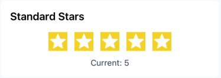
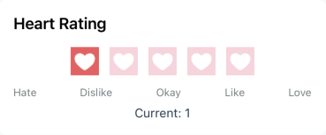
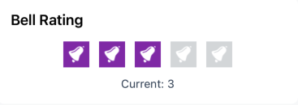
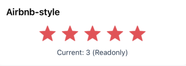
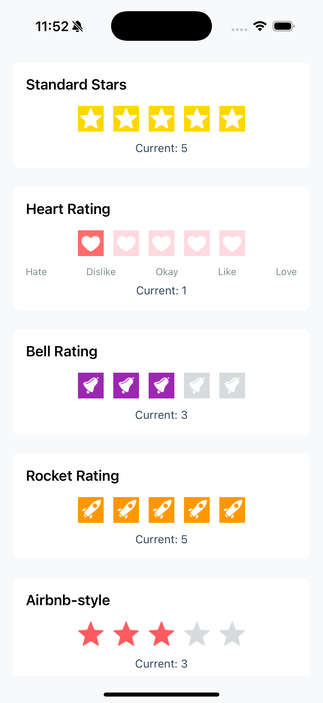

# React Native Rating Library

[](https://www.npmjs.com/package/react-native-product-ratings)
[](https://www.npmjs.com/package/react-native-product-ratings)
[](https://www.typescriptlang.org/)
[](./LICENSE)

A comprehensive and customizable rating component library for React Native applications, featuring multiple rating styles and interaction methods.

## Screenshots

<div style="display: flex; flex-wrap: wrap; gap: 16px; margin: 20px 0;">
  
  
  
  
  
</div>
<div style="display: flex; flex-wrap: wrap; gap: 16px; margin: 20px 0;">
  
</div>

## Features

- 🌟 Multiple rating components (Star, Tap, Swipe)
- 🎨 Customizable icons (star, heart, bell, rocket, airbnb)
- 🎯 Touch and swipe interactions
- 📱 Fractional ratings support
- 🎨 Fully customizable colors and sizes
- 🔒 Readonly and disabled states
- 📊 Rating labels and text display
- 🌐 RTL support

## Installation

```bash
npm install react-native-rating-library
# or
yarn add react-native-rating-library
```

## Components

### StarRating

Simple tap-to-rate component with optional half-rating support.

### TapRating

Tap-based rating with customizable labels above ratings.

### Rating

Advanced swipe-enabled rating component with animations.

### RatingImage

Customizable rating icon component supporting multiple icon types.

## Quick Start

```jsx
import React, { useState } from 'react';
import { View } from 'react-native';
import { Rating, StarRating, TapRating } from 'react-native-rating-library';

const App = () => {
  const [rating, setRating] = useState(3);

  return (
    <View style={{ padding: 20 }}>
      {/* Basic Star Rating */}
      <StarRating
        count={5}
        defaultRating={rating}
        size={40}
        selectedColor="#FFD700"
        onFinishRating={setRating}
      />

      {/* Tap Rating with Labels */}
      <TapRating
        count={5}
        defaultRating={rating}
        ratingLabels={{
          1: 'Poor',
          2: 'Fair',
          3: 'Good',
          4: 'Very Good',
          5: 'Excellent',
        }}
        onFinishRating={setRating}
      />

      {/* Swipe Rating */}
      <Rating
        count={5}
        startingValue={rating}
        showRating
        fractions={1}
        onFinishRating={setRating}
      />
    </View>
  );
};
```

## API Reference

### Common Props (RatingProps)

| Prop              | Type                     | Default            | Description                       |
| ----------------- | ------------------------ | ------------------ | --------------------------------- |
| `count`           | number                   | 5                  | Number of rating items to display |
| `defaultRating`   | number                   | 0                  | Initial rating value              |
| `size`            | number                   | 40                 | Size of rating icons              |
| `selectedColor`   | string                   | '#F1C40F'          | Color for selected/filled ratings |
| `unselectedColor` | string                   | '#BDC3C7'          | Color for unselected ratings      |
| `readonly`        | boolean                  | false              | Prevents user interaction         |
| `disabled`        | boolean                  | false              | Disables the component            |
| `startingValue`   | number                   | 0                  | Starting value for rating         |
| `onFinishRating`  | (rating: number) => void | -                  | Callback when rating is complete  |
| `style`           | ViewStyle                | -                  | Custom container styles           |
| `RatingImage`     | Component                | DefaultRatingImage | Custom rating icon component      |

### StarRating Props

Extends `RatingProps` with:

| Prop              | Type           | Default | Description              |
| ----------------- | -------------- | ------- | ------------------------ |
| `allowHalfRating` | boolean        | false   | Enable half-star ratings |
| `direction`       | 'ltr' \| 'rtl' | 'ltr'   | Layout direction         |

### TapRating Props

Extends `RatingProps` with:

| Prop             | Type                   | Default | Description                  |
| ---------------- | ---------------------- | ------- | ---------------------------- |
| `ratingLabels`   | Record<number, string> | {}      | Labels for each rating value |
| `labelStyle`     | object                 | -       | Custom label text styles     |
| `showRatingText` | boolean                | true    | Show rating text above stars |

### Rating Props

Extends `RatingProps` with:

| Prop            | Type                     | Default | Description                            |
| --------------- | ------------------------ | ------- | -------------------------------------- |
| `showRating`    | boolean                  | false   | Display current rating value           |
| `fractions`     | number                   | 2       | Decimal places for rating value        |
| `minValue`      | number                   | 0       | Minimum allowed rating                 |
| `jumpValue`     | number                   | 0.5     | Rating increment on tap                |
| `onSwipeRating` | (rating: number) => void | -       | Real-time rating callback during swipe |

### RatingImage Props

| Prop              | Type                                                | Default   | Description                         |
| ----------------- | --------------------------------------------------- | --------- | ----------------------------------- |
| `filled`          | boolean                                             | -         | Whether the icon is filled/selected |
| `size`            | number                                              | -         | Icon size                           |
| `tintColor`       | string                                              | '#F1C40F' | Color when filled                   |
| `unselectedColor` | string                                              | '#BDC3C7' | Color when unfilled                 |
| `type`            | 'star' \| 'heart' \| 'bell' \| 'rocket' \| 'airbnb' | 'star'    | Icon type                           |

## Examples

### Custom Icon Types

```jsx
import { StarRating, RatingImage } from 'react-native-rating-library';

// Heart Rating
<StarRating
  count={5}
  selectedColor="#FF6B6B"
  RatingImage={(props) => (
    <RatingImage {...props} type="heart" />
  )}
  onFinishRating={(rating) => console.log(rating)}
/>

// Bell Rating
<StarRating
  count={5}
  selectedColor="#9C27B0"
  RatingImage={(props) => (
    <RatingImage {...props} type="bell" />
  )}
  onFinishRating={(rating) => console.log(rating)}
/>
```

### Half Rating Support

```jsx
<StarRating
  count={5}
  allowHalfRating={true}
  defaultRating={3.5}
  selectedColor="#FFD700"
  onFinishRating={rating => console.log(rating)}
/>
```

### Swipe Rating with Display

```jsx
<Rating
  count={5}
  startingValue={0}
  showRating={true}
  fractions={1}
  minValue={1}
  onSwipeRating={rating => console.log('Swiping:', rating)}
  onFinishRating={rating => console.log('Final:', rating)}
/>
```

### Rating with Custom Labels

```jsx
<TapRating
  count={5}
  ratingLabels={{
    1: 'Terrible',
    2: 'Bad',
    3: 'Okay',
    4: 'Good',
    5: 'Amazing',
  }}
  selectedColor="#FF9800"
  onFinishRating={rating => console.log(rating)}
/>
```

### Readonly Rating Display

```jsx
<StarRating count={5} defaultRating={4.2} readonly={true} selectedColor="#4CAF50" size={30} />
```

### RTL Support

```jsx
<StarRating
  count={5}
  direction="rtl"
  selectedColor="#2196F3"
  onFinishRating={rating => console.log(rating)}
/>
```

## Styling

All components accept a `style` prop for container customization:

```jsx
<StarRating
  style={{
    backgroundColor: '#f5f5f5',
    padding: 15,
    borderRadius: 10,
    marginVertical: 10,
  }}
  // ... other props
/>
```

## Custom Rating Images

You can provide your own rating image component:

```jsx
import { StarRating } from 'react-native-rating-library';

const CustomRatingImage = ({ filled, size, tintColor }) => (
  <View
    style={{
      width: size,
      height: size,
      backgroundColor: filled ? tintColor : '#ccc',
      borderRadius: size / 2,
    }}
  />
);

<StarRating
  RatingImage={CustomRatingImage}
  // ... other props
/>;
```

## License

MIT

## Contributing

Contributions are welcome! Please feel free to submit a Pull Request.

## License

MIT © [KGG Dev](https://github.com/gitfullstacker)

## Contact

KGG Dev - [@kgg.dev.company](https://www.facebook.com/kgg.dev.company) - fullstackdev2024@gmail.com

Project Link: [https://github.com/gitfullstacker/react-native-product-ratings](https://github.com/gitfullstacker/react-native-product-ratings)
