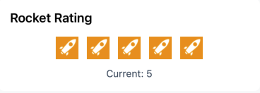

# react-native-product-ratings

[](https://www.npmjs.com/package/react-native-product-ratings)
[](https://www.npmjs.com/package/react-native-product-ratings)
[](https://www.typescriptlang.org/)
[](./LICENSE)

A fully customizable ratings component for React Native with multiple icon styles.

## Screenshots

<div style="display: flex; flex-wrap: wrap; gap: 16px; margin: 20px 0;">
  
  
  
  
  
</div>
<div style="display: flex; flex-wrap: wrap; gap: 16px; margin: 20px 0;">
  
</div>

## Features

- ⭐ Multiple rating types (Star Rating, Swipe Rating, Tap Rating)
- 🎨 Fully customizable styling
- 📱 Compatible with React Native CLI
- 👆 Interactive swipe and tap gestures
- 🖼️ Support for custom rating images
- 🔢 Optional rating display
- 📊 Custom rating increments (whole, half, or fractional)
- 🛠️ Full TypeScript support
- ↔️ RTL layout support
- 🏷️ Optional rating labels

## Installation

```bash
# Using npm
npm install react-native-product-ratings

# Using yarn
yarn add react-native-product-ratings
```

## Usage

### StarRating Component

```tsx
import React from "react";
import { StyleSheet, View } from "react-native";
import { StarRating } from "react-native-product-ratings";

const ProductRatingScreen = () => {
  return (
    <View style={styles.container}>
      <StarRating
        defaultRating={3.5}
        count={5}
        size={40}
        onFinishRating={(rating) => console.log(`Rating is: ${rating}`)}
        selectedColor="#FFD700"
        allowHalfRating={true}
      />
    </View>
  );
};

const styles = StyleSheet.create({
  container: {
    flex: 1,
    justifyContent: "center",
    alignItems: "center",
    padding: 16,
  },
});

export default ProductRatingScreen;
```

### Swipeable Rating Component

```tsx
import React from "react";
import { StyleSheet, Text, View } from "react-native";
import { Rating } from "react-native-product-ratings";

const SwipeRatingScreen = () => {
  return (
    <View style={styles.container}>
      <Text style={styles.title}>How would you rate this product?</Text>
      <Rating
        defaultRating={0}
        count={5}
        size={50}
        showRating={true}
        onSwipeRating={(rating) => console.log(`Current rating: ${rating}`)}
        onFinishRating={(rating) => console.log(`Final rating: ${rating}`)}
        selectedColor="#FF8C00"
      />
    </View>
  );
};

const styles = StyleSheet.create({
  container: {
    flex: 1,
    justifyContent: "center",
    alignItems: "center",
    padding: 16,
    backgroundColor: "#F5F5F5",
  },
  title: {
    fontSize: 18,
    fontWeight: "bold",
    marginBottom: 20,
  },
});

export default SwipeRatingScreen;
```

### TapRating with Labels

```tsx
import React from "react";
import { StyleSheet, Text, View } from "react-native";
import { TapRating } from "react-native-product-ratings";

const ProductFeedbackScreen = () => {
  return (
    <View style={styles.container}>
      <Text style={styles.title}>Rate your experience</Text>
      <TapRating
        count={5}
        defaultRating={0}
        size={35}
        showRatingText={true}
        ratingLabels={{
          1: "Poor",
          2: "Below Average",
          3: "Good",
          4: "Very Good",
          5: "Excellent",
        }}
        selectedColor="#4CAF50"
        onFinishRating={(rating) => console.log(`Rated: ${rating}`)}
      />
    </View>
  );
};

const styles = StyleSheet.create({
  container: {
    flex: 1,
    justifyContent: "center",
    alignItems: "center",
    padding: 16,
  },
  title: {
    fontSize: 20,
    fontWeight: "bold",
    marginBottom: 24,
    color: "#333",
  },
});

export default ProductFeedbackScreen;
```

## Custom Rating Images

You can use built-in icons or provide custom images:

```tsx
import { Rating, RatingImage } from "react-native-product-ratings";

// Using built-in icons
<Rating
  count={5}
  RatingImage={(props) => (
    <RatingImage
      {...props}
      type="heart" // 'star' | 'heart' | 'bell' | 'rocket' | 'airbnb'
      tintColor="#FF6B6B" // Selected color
      unselectedColor="#CCCCCC" // Outline color
    />
  )}
/>;

// Using custom images
const CustomImage = ({ filled, size }) => (
  <Image
    source={filled ? require("./filled.png") : require("./outline.png")}
    style={{ width: size, height: size }}
  />
);

<Rating RatingImage={CustomImage} />;
```

**Available Icon Types:**

- `star`: Classic star rating
- `heart`: Heart icons
- `bell`: Bell icons
- `rocket`: Rocket icons
- `airbnb`: Airbnb-style stars

**RatingImage Props:**
| Prop | Type | Default | Description |
|------|------|---------|-------------|
| `filled` | boolean | required | Whether icon should appear filled |
| `size` | number | required | Icon dimensions |
| `tintColor` | string | '#F1C40F' | Color for filled state |
| `unselectedColor` | string | '#BDC3C7' | Color for outline state |
| `type` | string | 'star' | Icon type to use |

## API Reference

### Common Props (All Components)

| Prop             | Type                                  | Default            | Description                        |
| ---------------- | ------------------------------------- | ------------------ | ---------------------------------- |
| `count`          | number                                | 5                  | Number of rating images            |
| `defaultRating`  | number                                | 0                  | Initial rating value               |
| `size`           | number                                | 40                 | Size of rating images              |
| `onFinishRating` | (rating: number) => void              | () => {}           | Callback when rating is completed  |
| `selectedColor`  | string                                | '#F1C40F'          | Color for selected rating items    |
| `readonly`       | boolean                               | false              | If true, rating cannot be modified |
| `disabled`       | boolean                               | false              | If true, component is disabled     |
| `style`          | StyleProp<ViewStyle>                  | {}                 | Custom container style             |
| `startingValue`  | number                                | defaultRating      | Alternative initial rating         |
| `RatingImage`    | React.ComponentType<RatingImageProps> | DefaultRatingImage | Custom rating image component      |

### Rating Component (Swipe)

Additional props:

| Prop            | Type                     | Default  | Description               |
| --------------- | ------------------------ | -------- | ------------------------- |
| `onSwipeRating` | (rating: number) => void | () => {} | Callback during swipe     |
| `showRating`    | boolean                  | false    | Show numeric rating value |
| `fractions`     | number                   | 2        | Decimal precision         |
| `minValue`      | number                   | 0        | Minimum rating value      |
| `jumpValue`     | number                   | 0.5      | Rating increment for taps |

### StarRating Component

Additional props:

| Prop              | Type           | Default | Description             |
| ----------------- | -------------- | ------- | ----------------------- |
| `allowHalfRating` | boolean        | false   | Allow half-star ratings |
| `direction`       | 'ltr' \| 'rtl' | 'ltr'   | Layout direction        |

### TapRating Component

Additional props:

| Prop             | Type                   | Default | Description             |
| ---------------- | ---------------------- | ------- | ----------------------- |
| `ratingLabels`   | Record<number, string> | {}      | Text labels for ratings |
| `labelStyle`     | StyleProp<TextStyle>   | {}      | Style for labels        |
| `showRatingText` | boolean                | true    | Show rating labels      |

## TypeScript Support

This package includes TypeScript definitions. You can import types directly:

```tsx
import {
  RatingImageProps,
  RatingProps,
  StarRatingProps,
  TapRatingProps,
} from "react-native-product-ratings";
```

## Examples

Check out the examples directory for more usage examples:

- Basic rating
- Swipeable rating with fractional values
- Custom images
- TapRating with labels
- RTL support

## Contributing

Contributions are welcome! Please follow these steps:

1. Fork the Project
2. Create your Feature Branch (`git checkout -b feature/amazing-feature`)
3. Commit your Changes (`git commit -m 'Add some amazing feature'`)
4. Push to the Branch (`git push origin feature/amazing-feature`)
5. Open a Pull Request

## License

MIT © [KGG Dev](https://github.com/gitfullstacker)

## Contact

KGG Dev - [@kgg.dev.company](https://www.facebook.com/kgg.dev.company) - fullstackdev2024@gmail.com

Project Link: [https://github.com/gitfullstacker/react-native-product-ratings](https://github.com/gitfullstacker/react-native-product-ratings)
